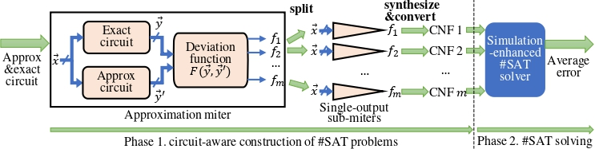

# VACSEM: Verifying average errors in approximate circuits using simulation-enhanced model counting

VACSEM is used to formally verify the average error (*e.g.*, error rate and mean error distance) of approximate circuits.

Its overall flow is shown below:



It has two phases:

- Phase 1 inputs an approximate circuit and an exact circuit (both in [BLIF](https://course.ece.cmu.edu/~ee760/760docs/blif.pdf) format). 

  Then, it converts the average error verification problem into the model counting (also call #SAT) problem. Specifically, it builds an approximation miter to represent the deviation between the approximate and exact circuits, and converts the miter into multiple [CNF](https://people.sc.fsu.edu/~jburkardt/data/cnf/cnf.html) files. Each CNF file represents a model counting (#SAT) problem to to solved.

  It outputs the CNF files.

- Phase 2 is an efficient simulation-enhanced #SAT solver. It inputs the CNF file from Phase 1. It outputs the solution to the #SAT problem.

  After solving the #SAT problems from Phase 1, we can combine the solutions and obtain average error.

For more details, you can refer to the following paper:

[Chang Meng, Hanyu Wang, Yuqi Mai, Weikang Qian, and Giovanni De Micheli, "*VACSEM: Verifying average errors in approximate circuits using simulation-enhanced model counting*," to appear in Design, Automation & Test in Europe Conference & Exhibition (DATE), Valencia, Spain, 2024.](https://github.com/changmg/changmg.github.io/blob/master/preprint/Meng_Wang_Mai_Qian_DeMicheli_VACSEM-Verifying_Average_Errors_in_Approximate_Circuits_Using_Simulation-Enhanced_Model_Counting.pdf)

## Project Structure

There are two important folders in the root directory of VACSEM project:

1. Circuit2Cnf: This folder contains the first sub-project of VACSEM, which corresponds to Phase 1 in the above figure, i.e., circuit-aware construction of #SAT problems

2. SimSharpSat: This folder contains the second sub-project of VACSEM, which corresponds to Phase 2 in the above figure, i.e., simulation-enhanced model counting.

   ***The sub-project "SimSharpSat" is developed based on the open-source #SAT tool GANAK. We are deeply grateful to authors of GANAK for their clear and easy-to-use code!***
   
   ***Note that in our paper, we are comparing to the [GANAK](https://github.com/meelgroup/ganak/tree/9b20008ea07c6be9f7be6ca40384ff01cc026413) with the git commit ID "9b20008ea07c6be9f7be6ca40384ff01cc026413", released on July 9, 2023, which works on a single CPU thread.***

## Dependencies 

- Reference environment, **Ubuntu 20.04 LTS** with the following tools and libraries:

  - Tools: gcc 10.3.0 & g++ 10.3.0 & [cmake](https://cmake.org/) 3.16.3

    You can install these tools with the following command:

    ```shell
    sudo apt install gcc-10
    sudo apt install g++-10
    sudo apt install cmake
    ```

    You also need to check whether the default versions of gcc and g++ are 10.3.0:

    ```shell
    gcc --version
    g++ --version
    ```

    If the default versions of gcc and g++ are not 10.3.0, please change them to 10.3.0.

  - Libraries: [libboost](https://www.boost.org/) 1.74.0, libreadline 8.0-4, libgmp, libmpfr, libmpc

    You can install these libraries with the following command:

    ```shell
    sudo apt install libboost1.74-all-dev
    sudo apt install libreadline-dev
    sudo apt install libgmp-dev
    sudo apt-get install libmpfr-dev
    sudo apt-get install libmpc-dev
    ```

  - **Optionally**, to build the "Deviation Function $F(\vec y,\vec y')$" unit in the above figure, you need [Yosys](https://yosyshq.net/yosys/) & [abc](https://people.eecs.berkeley.edu/~alanmi/abc/)

    You can install the tools using the following command:

    ```shell
    sudo apt install yosys
    sudo apt install berkeley-abc
    ```

  - **Optionally**, to run the baseline method GANAK, you can download it from this [git repository](https://github.com/meelgroup/ganak/tree/9b20008ea07c6be9f7be6ca40384ff01cc026413)

    Again, in our paper, we are comparing to the GANAK with the git commit ID "9b20008ea07c6be9f7be6ca40384ff01cc026413", released on July 9, 2023, which works on a single CPU thread.

- **Alternatively, we prepare a docker image containing the dependencies:**

  https://hub.docker.com/r/changmeng/als_min

## Download

VACSEM contains a submodule: open-source logic synthesis and verification tool abc

There are two ways of downloading VACSEM:

1. Clone the VACSEM project, and then update the submodules:

```shell
git clone https://github.com/changmg/VACSEM.git
cd VACSEM
git submodule init
git submodule update
```

2. Alternatively, clone the VACSEM project as well as the submodules: 

```shell
git clone --recursive https://github.com/changmg/VACSEM.git
```

## Build

- To build, go to the root directory of the project, and then execute:

```shell
mkdir build
cd build
cmake -DCMAKE_BUILD_TYPE=Release ..
make
cd ..
```

If you compile successfully, you will obtain the following two executable programs:

1. Circuit2Cnf.out, corresponding to Phase 1 (converting circuit to CNF) in the above figure.
2. SimSharpSat.out, corresponding to Phase 2 (#SAT solving) in the above figure.

- To clean up, go to the root directory of the project, and then execute:

```
rm -r build
```

## Run

### Phase 1. Circuit2Cnf

**Example command 1 for error rate metric:**

```shell
./Circuit2Cnf.out -t ER -e ./Circuit2Cnf/input/mult15/mult15.blif -a ./Circuit2Cnf/input/mult15/22_mult15_err_0.0944366_size_1696_depth_40.blif -o ./tmp/22_mult15_err_0.0944366.cnf
```

In this example, 

- The program inputs an exact circuit "./Circuit2Cnf/input/mult15/mult15.blif"
- It inputs an approximate circuit "./Circuit2Cnf/input/mult15/22_mult15_err_0.0944366_size_1696_depth_40.blif"
- It builds an approximation miter (as shown in the above figure) for the error rate (ER) metric
- It outputs a CNF file "./tmp/22_mult15_err_0.0944366.cnf", converted from the approximation miter

**Example command 2 for the mean error distance metric:**

```shell
./Circuit2Cnf.out -t MED -e ./Circuit2Cnf/input/mult15/mult15.blif -a ./Circuit2Cnf/input/mult15/22_mult15_err_0.0944366_size_1696_depth_40.blif -d ./Circuit2Cnf/input/deviation-function/width_30_absolute_error.blif -o ./tmp/22_mult15_err_0.0944366.cnf
```

In this example, 

- The program inputs an exact circuit "./Circuit2Cnf/input/mult15/mult15.blif"

- It inputs an approximate circuit "./Circuit2Cnf/input/mult15/22_mult15_err_0.0944366_size_1696_depth_40.blif"

- It builds an approximation miter (as shown in the above figure) for the mean error distance (MED) metric

- To build the approximation miter, the program needs a "Deviation Function $F(\vec y,\vec y')$" unit in the above figure. This unit is specified as "./Circuit2Cnf/input/mult15/22_mult15_err_0.0944366_size_1696_depth_40.blif"

  To create the deviation-function circuits, you can refer to the script "./Circuit2Cnf/script/BuildDeviation.py"

- As shown in the above figure, the program splits the approximation miter into $m$ single-output sub-miters, where $m$ is the number of primary outputs. Each sub-miter encodes the #SAT problem for each primary output.

  The CNF files for these sub-miters are named "./tmp/22_mult15_err_0.0944366_0.cnf", "./tmp/22_mult15_err_0.0944366_1.cnf", ..., "./tmp/22_mult15_err_0.0944366_{m-1}.cnf"

  If a sub-miter outputs a constant 0/1, then the CNF file name will end with "\_const0" or "\_const1". In this case, the solution of the #SAT problem is trivial.

### Phase 2. SimSharpSat

**Example command**

```shell
./SimSharpSat.out -t 14400 ./tmp/22_mult15_err_0.0944366.cnf
```

In this example,

- The time limit is set as 14400s
- The input CNF file is "./tmp/22_mult15_err_0.0944366.cnf"
